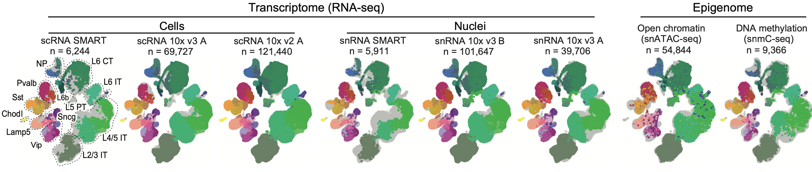

Physics PhD student in Prof. Eran Mukamel's [lab](https://brainome.ucsd.edu) at UCSD.

- [CV](./doc/CV.pdf)
- [Google scholar](https://scholar.google.com/citations?user=27FYCbIAAAAJ&hl=en)
- [ORCID](https://orcid.org/0000-0001-5232-1648)
<!-- - [Github](https://github.com/FangmingXie) -->

[Here](https://brainome.ucsd.edu/BICCN_MOp) are some data of mouse brain cell transcriptomes and epigenomes, which displays the DNA methylation, chromatin accessibility, and gene expression profiles of 56 neuronal cell types identified from >400,000 single cells from the mouse primary motor cortex. More details are in [this](https://www.biorxiv.org/content/10.1101/2020.02.29.970558v2) preprint.

<!--  -->